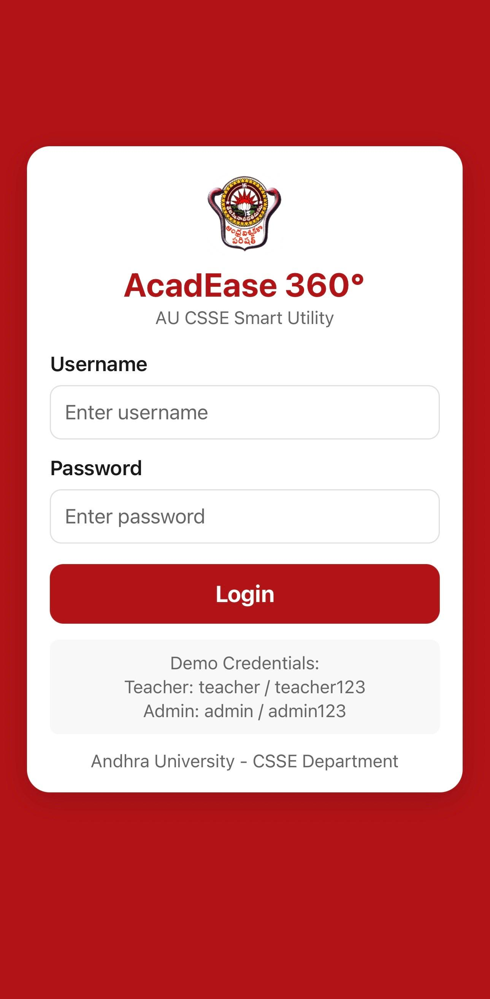
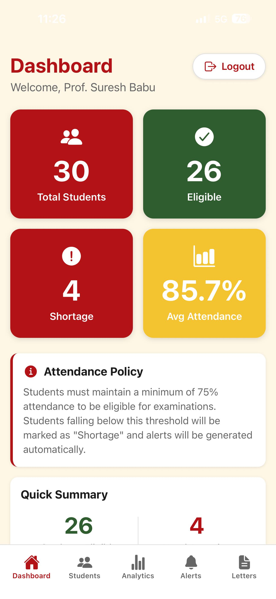
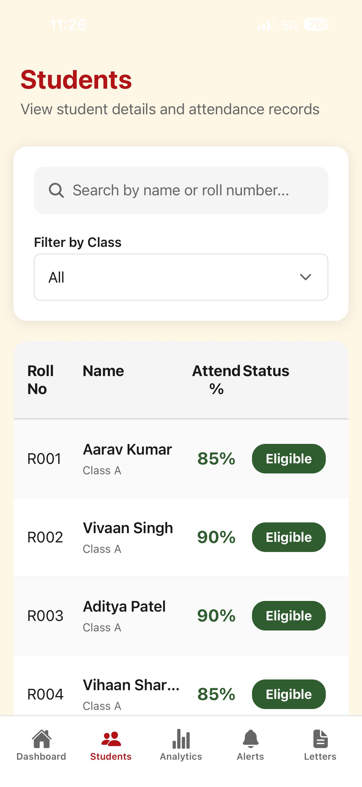
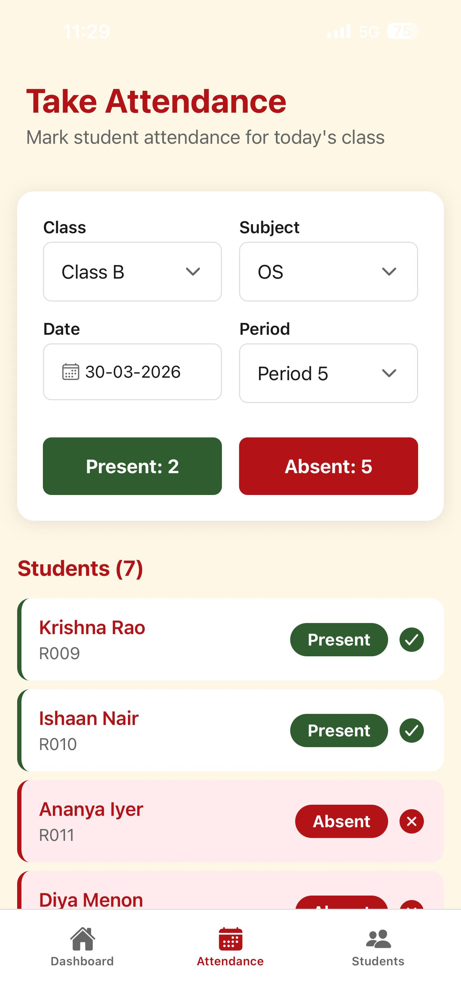
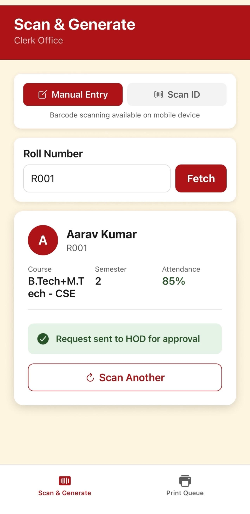
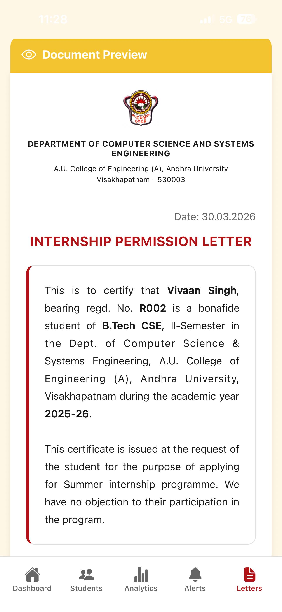
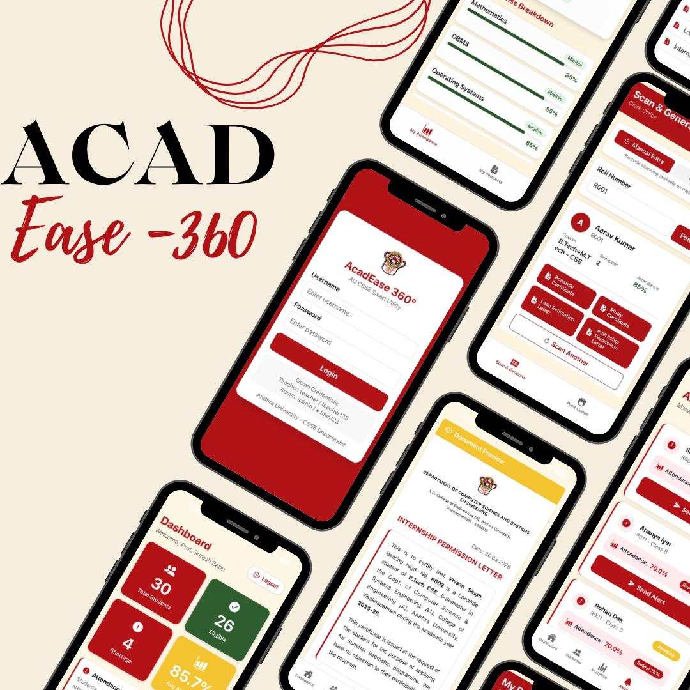

# AcadEase 360° 🎓
### AU CSSE Smart Utility — *One app. Four roles. Zero paperwork.*

> Built for the **AU Centenary Hackathon 2026** · Andhra University, Department of CS&SE  
> Team **Code Is Solved Problem** · Waseem Rahmani · Jagana Vaishnavi · Meda Neeraja Sai · Mukund Agrawal

---

## 🏆 Hackathon Context

**Event:** AU Centenary 2026 Hackathon — Andhra University's 100th Anniversary flagship tech event  
**Theme:** Digitising university administrative workflows for the modern era  
**Department:** Computer Science & Systems Engineering (CS&SE)  
**Academic Year:** 2025–26

---

## 🧩 Problem Statement

The CS&SE department at Andhra University ran entirely on manual, paper-based processes. Four major pain points drove this project:

| # | Problem | Impact |
|---|---------|--------|
| 01 | Attendance recorded manually | Error-prone, delayed, no audit trail |
| 02 | Certificate requests need physical visits to HOD | 2–3 working days per certificate |
| 03 | Official letters drafted manually each time | Repetitive clerk work, inconsistent formatting |
| 04 | No centralised eligibility tracking | Students unaware of shortage status until exams |

---

## 💡 Solution — AcadEase 360°

A **cross-platform mobile application** that digitises the entire department workflow across four roles in one unified system.

### Before vs After

| Before | With AcadEase 360° |
|--------|-------------------|
| Manual student application | Clerk scans student ID — details auto-fetched |
| Physical visit to HOD's office | Eligibility verified instantly by the system |
| Letter drafted by clerk manually | HOD approves digitally with one tap |
| Process takes 2–3 working days | Certificate with QR code ready in **minutes** |

---

## ⚙️ Core Features

### 📋 Smart Attendance
- Subject-wise and date-wise attendance marking
- Works **offline** — teachers can mark attendance without internet
- Auto-sync to server on reconnect via AsyncStorage + NetInfo

### 🔄 Digital Approval Chain
- Full workflow: **Student → Clerk → HOD → Certificate Print**
- Real-time status tracking at every stage
- No physical paperwork at any step

### 📄 Auto Certificate Generation
- **4 document types** generated automatically:
  - Bonafide Certificate
  - Study Certificate
  - Loan Estimation Letter
  - Internship Permission Letter
- PDF-ready output formatted on official AU letterhead

### 🔐 QR Verification
- Every printed certificate carries an embedded **QR code**
- Scan to instantly verify authenticity — prevents forgery

### 🚨 Shortage Alerts
- Auto-flags students below **75% attendance threshold**
- SMS notifications via **Twilio integration**
- Alerts dashboard for HOD/Admin with one-tap send

### 👥 Role-Based Access
Four distinct dashboards in a single app:

| Role | Key Capabilities |
|------|-----------------|
| **Teacher** | Take attendance, view subject analytics |
| **Admin / HOD** | Approve requests, view analytics, send alerts |
| **Clerk** | Scan student ID, generate & print certificates |
| **Student** | View attendance, track certificate request status |

---

## 🛠 Tech Stack

| Layer | Technology |
|-------|------------|
| **Frontend** | React Native (Expo) — cross-platform iOS & Android |
| **Backend** | FastAPI (Python 3.11) — REST API with Uvicorn |
| **Database** | MongoDB — flexible document store |
| **SMS Alerts** | Twilio |
| **Offline Support** | AsyncStorage + NetInfo auto-sync |
| **Auth** | Role-based JWT authentication |

### Architecture

```
Presentation Layer (React Native · Expo Router · Context API)
        │
        │  REST / HTTPS
        ▼
Application Layer (FastAPI · Python 3.11 · Uvicorn)
├── Auth Service
├── Attendance Engine
├── Analytics + At-Risk Engine
├── Alert Service (Twilio SMS)
└── Approval Workflow Engine
    ├── Letter Generator + QR
    ├── Audit Log Writer
    ├── Bulk Sync Handler
    └── Student Manager
        │
        │  PyMongo Driver
        ▼
Data Layer (MongoDB)
├── Students (70 real records)
├── Attendance (Sessions log)
├── Letter Requests (Status + token)
├── Audit Log (All actions)
└── Users (4 role accounts)
```

---

## 📱 App Screens

### Login



> Role-based login — Teacher, Admin/HOD, Clerk, and Student each get a tailored dashboard after authentication.

---

### HOD Dashboard & Analytics



> At a glance: 30 students · 26 eligible · 4 on shortage · 85.7% avg attendance. Analytics tab breaks it down by eligibility, day, and subject.

---

### Student Records & Shortage Alerts



> Search and filter all students by name or roll number. Alerts tab auto-flags anyone below the 75% threshold — one tap sends an SMS via Twilio.

---

### Take Attendance



> Teachers select class, subject, date and period — then mark each student present or absent. Works fully **offline**, syncs automatically on reconnect.

---

### Auto-Generated Certificate (PDF)



> Official AU letterhead, auto-populated with student data, date-stamped and QR-verified. Ready to print in minutes — no clerk drafting needed.

---

## 🌐 Offline-First Design



Built for real classroom conditions — poor network environments included.

- **Attendance marking** works fully offline
- Records stored locally and **auto-pushed on reconnect**
- Document approval workflows require connectivity (real-time multi-party coordination)

---

## 🎨 Design Identity




The UI uses Andhra University's centenary color palette:

| Color | Hex | Meaning |
|-------|-----|---------|
| AU Deep Red | `#B31217` | Strength · Tradition · Authority |
| Saffron Gold | `#F4C430` | Wisdom · Prosperity · Centenary |
| Forest Green | `#2F5D2F` | Growth · Knowledge · Sustainability |
| Warm Cream | `#FFF7E6` | Purity · Openness · Clean Canvas |

---

## 🚀 Getting Started

### Prerequisites
```bash
node >= 18
python >= 3.11
mongodb running locally or Atlas URI
```

### Backend
```bash
cd backend
pip install -r requirements.txt
uvicorn main:app --reload
```

### Frontend
```bash
cd frontend
npm install
npx expo start
```

### Demo Credentials
```
Teacher:  teacher / teacher123
Admin:    admin / admin123
Clerk:    clerk / clerk123
Student:  student / student123
```

---

## 📁 Repository Structure

```
AcadEase360/
├── frontend/          # React Native (Expo) app
│   ├── screens/       # Teacher, HOD, Clerk, Student views
│   ├── components/    # Shared UI components
│   └── context/       # Auth & state management
├── backend/           # FastAPI server
│   ├── routes/        # Attendance, letters, alerts, auth
│   ├── models/        # MongoDB schemas
│   └── services/      # Workflow engine, QR, Twilio
├── docs/
│   └── screenshots/   # App screen captures (7 screens)
└── README.md
```

---

## 🔮 Future Scope

- [ ] Biometric / face-recognition attendance
- [ ] Integration with AU's central student database
- [ ] Analytics dashboard with semester-level trends
- [ ] Push notifications (Firebase FCM)
- [ ] Admin panel web dashboard

---

## 👥 Team — Code Is Solved Problem

| Name | Role |
|------|------|
| Waseem Rahmani | Backend & Workflow Engine |
| Jagana Vaishnavi | PPT Presentation |
| Meda Neeraja Sai | Frontend & UI/UX , Database & Certificate Generation |
| Mukund Agrawal | Integrations & Offline Sync |

*Proudly built in AU's Centenary Year — Andhra University, Department of CS&SE, 2025–26*
